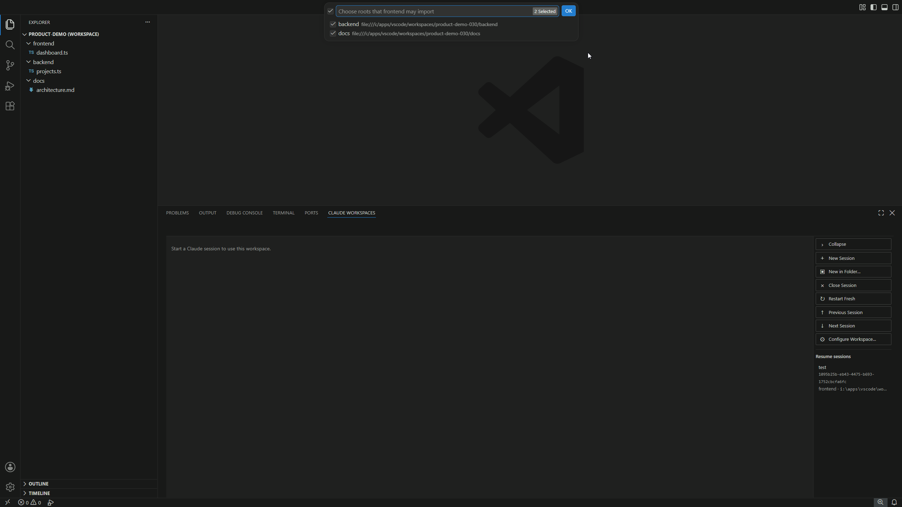
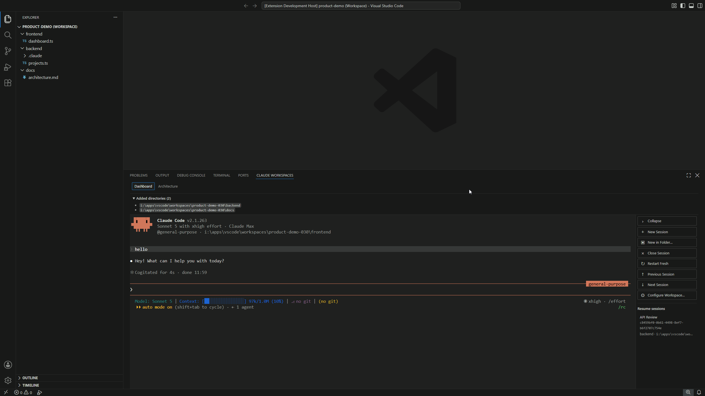
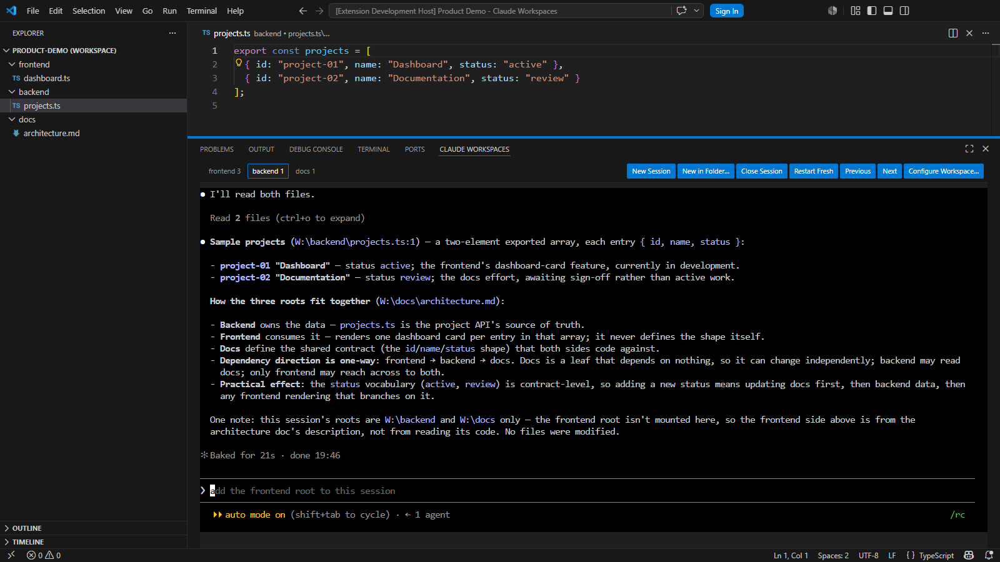

# Claude Workspaces

Manage workspace-aware Claude Code sessions across VS Code multi-root workspaces.

## Features

- Start Claude Code in any root of a saved multi-root workspace.
- Configure directed cross-root imports for each workspace root.
- Keep multiple live sessions organized in one VS Code panel.
- Rename supported sessions and resume them from saved metadata.
- Review each session's root, imported paths, status, and available actions.

## Install

Install Claude Workspaces from the [VS Code Marketplace](https://marketplace.visualstudio.com/items?itemName=cbeaulieu-gt.vscode-claude-workspaces), or run:

```bash
code --install-extension cbeaulieu-gt.vscode-claude-workspaces
```

Version 0.4.0 targets the Marketplace stable channel. After it is published,
select **Install** or **Switch to Release Version** on the Marketplace listing.
The validated 0.3.1 pre-release line is promoted to 0.4.0. New features begin in
the 0.5.x pre-release line.

To build and install the Windows x64 stable VSIX from this source checkout:

```bash
npm ci
npm run package:stable
code --install-extension dist/claude-workspaces-win32-x64.vsix
```

To build the previous pre-release VSIX from source, use the immutable `v0.3.1`
tag in a separate checkout:

```bash
git switch --detach v0.3.1
npm ci
npm run package:prerelease
code --install-extension dist/claude-workspaces-win32-x64.vsix
```

## Release policy

Version 0.4.0 targets the stable channel and supports VS Code 1.120.0 and later.
Odd minor versions are feature pre-release lines. After validation, the latest
odd-minor patch is promoted without new product behavior to the next even-minor
stable version. New features then begin in the next odd-minor pre-release line.

The extension is available only when VS Code has opened a saved
`.code-workspace` file. It intentionally does not activate in a folder window
or an untitled workspace.

## Feature tour

Choose which workspace roots each Claude session may import.



Name your active sessions and resume saved conversations from the sidebar.



Work with Claude Code in the embedded terminal, using the selected root and its
configured imports.



## Configuration

Claude Workspaces stores its configuration in VS Code's workspace-local extension
state; it never writes to the `.code-workspace` file. On first use, and whenever
the ordered workspace folder set changes, it prompts for an optional default root
and directed cross-root imports. Dismissing the prompt keeps the first workspace
folder as the effective default and disables every cross-root import.

For Claude Code installations that support UUID-backed sessions, the same
workspace-local extension state stores resumable-session metadata: the Claude
session UUID, display name, original root identity, root label and path, creation
time, and last-launch time. Claude Workspaces does not copy or store Claude's
transcript contents.

`claudeWorkspaces.claudeExecutable` is an optional string setting for a Claude
executable path or command. Leave it unset to use `claude` from the extension
host's `PATH`.

`claudeWorkspaces.sessionDetailsInitiallyExpanded` controls whether the session
details bar starts expanded and defaults to `true`. The bar shows the launch
root and the exact `--add-dir` paths supplied when the active session launched.
The launch root is the directory where the session started, not a live tracker
of later `cd` commands; collapsing the bar does not change the running session.

## Commands and sessions

The Claude Workspaces panel and Command Palette provide New Session, New in
Folder, Close Session, Restart Fresh, Previous/Next Session, and Configure
Workspace. Sessions are owned only by this extension: closing or deactivating
the extension terminates its managed Claude processes without changing VS Code
terminals or externally launched Claude processes. Saved conversations appear in
the panel's separate **Resume sessions** list after their live process closes.
Opening and closing a session without sending a prompt does not create a saved
conversation, so it stays out of the list.
Retry and Restart Fresh always resolve the current workspace configuration before
launching.

Right-click a session tab and choose **Rename Session…** to give that live
session a custom display name. The menu is also available with `Shift+F10` or
the Menu key while the tab is focused. Renames are saved for UUID-backed
sessions and reused when those sessions resume. Restart Fresh creates a separate
new session with the normal generated name.

Choose a saved entry under **Resume sessions** to reopen it in its original
workspace root. Before launching, Claude Workspaces verifies that the root is
still present at the exact saved path and resolves the current executable,
cross-root imports, and filesystem availability. A UUID already represented by
a live managed session is hidden from the resume list and cannot be launched a
second time.

Each entry shows its full Claude session ID and a relative **Last opened** time
beneath its name, so similarly named or older conversations remain
distinguishable. The relative value refreshes while the panel stays open; hover
the entry to see the exact launch time in your local timezone.

Right-click an entry under **Resume sessions** and choose **Forget Session**
to remove its saved metadata. With the entry focused, `Shift+F10` or the Menu
key opens the same menu. Forgetting removes the entry from this workspace’s
resume list; it does not delete Claude transcripts or stop another session.

**Forget Session** is also available from failed-resume notifications. If the
saved root is missing or has changed, the notification also offers **Start New**
and **Configure Workspace…**. If Claude rejects a stale session, it instead
offers **Start New** and **Open Logs**. Dismissing either notification keeps the
saved metadata.

HTTP and HTTPS links in session output can be opened through VS Code with
Ctrl+click on Windows/Linux or Cmd+click on macOS. A regular click remains
available for terminal text selection.

Use **Configure Workspace…** to select an optional default root and directed
cross-root imports. Reopening the command highlights the saved default root and
checks each saved import that is still part of the workspace, so you can adjust
the current configuration instead of rebuilding it. Cancelling any picker keeps
the previously saved configuration unchanged. A launch starts Claude in its
selected root and passes each enabled available import as a separate `--add-dir`
argument.

## V1 limitations

V1 is session-oriented rather than a general terminal or a Claude conversation
client. It does not reconnect to a still-running process, adopt externally
launched Claude sessions, run outside a saved workspace, or provide
general-purpose terminal features. Resumption is available only when the
configured Claude executable advertises both `--session-id` and `--resume`;
if either flag is unavailable, or if the capability probe errors or times out,
new sessions still launch normally but do not create resumable metadata.

Claude owns transcript storage, retention, and cleanup. Claude Workspaces neither
inspects nor deletes those transcript files, so saved metadata can outlive the
Claude transcript it identifies. See Claude Code's
[session documentation](https://code.claude.com/docs/en/sessions) for the
transcript lifecycle.

Workspace-level `CLAUDE.md` configuration and shared skill discovery are future
scope, not current features.

## Runtime requirements

- Windows x64
- VS Code 1.120.0 or later
- Claude Code installed and available on the VS Code extension host `PATH`, or
  configured with `claudeWorkspaces.claudeExecutable`

## Development prerequisites

- Node.js 24 (recommended)
- npm

## Troubleshooting

- Save the workspace as a `.code-workspace` file before using the commands or
  panel.
- Verify that `claude` is available on the VS Code extension host `PATH`, or
  set `claudeWorkspaces.claudeExecutable` to the executable path or command.
  Paths containing spaces are supported.
- Use **Configure Workspace…** after workspace roots change or when a launch
  skips unavailable local or network import roots.
- If a saved root was removed, renamed, or moved, choose **Start New** to launch
  from the current default configuration, **Forget Session** to remove its saved
  metadata, or **Configure Workspace…** to review roots and imports.
- If Claude rejects a saved UUID after its transcript was cleaned up, choose
  **Start New**, **Forget Session**, or **Open Logs**. Closing the notification
  leaves the saved metadata unchanged.
- If no **Resume sessions** entries appear, run `claude --help` using the same
  executable configured for the extension and confirm that it lists both
  `--session-id` and `--resume`. A failed or timed-out help probe also skips
  resumable metadata, but it does not block normal new-session launches.
- If Claude exits immediately or fails to start, use the notification's
  **Retry** or **Open Logs** action to inspect the Claude Workspaces output.

## Development

See [CONTRIBUTING.md](CONTRIBUTING.md) for setup, validation, pull request, and
documentation guidance.

## Publishing

Pushing a `vMAJOR.MINOR.PATCH` tag runs the
[Publish workflow](.github/workflows/publish.yml). The workflow verifies that
the tag matches `package.json`, derives the channel from the version, runs the
full validation suite, packages and publishes the Windows x64 VSIX, and creates
or updates the matching GitHub Release from [CHANGELOG.md](CHANGELOG.md). Odd
minor versions publish as pre-releases; even minor versions publish as stable
releases.

The repository must provide an Actions secret named `VSCE_PAT` containing an
Azure DevOps personal access token with **All accessible organizations** access
and **Marketplace (Manage)** scope for the `cbeaulieu-gt` publisher. See the
[VS Code publishing documentation](https://code.visualstudio.com/api/working-with-extensions/publishing-extension)
for token creation and Marketplace prerequisites.

To retry an existing tag without moving it, open **Actions → Publish → Run
workflow** and enter the tag. The same validation and publication sequence
runs against that immutable tag.
